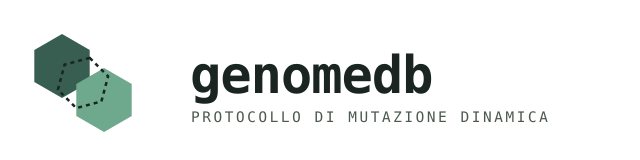

<p align="center">
  <picture>
    <source media="(prefers-color-scheme: dark)" srcset="docs/logo-dark.svg">
    
  </picture>
</p>

<p align="center">
  <a href="go.mod"></a>
  
  
  
</p>

Prototipo funzionante del "Protocollo di Mutazione Dinamica": un database
distribuito organico dove l'orchestratore non vede mai dati o chiavi, i
client frammentano/cifrano/mutano localmente, e un nodo compromesso muta
chiave+identità senza fermare il resto del sistema.

## Comandi rapidi

```bash
export PATH="$HOME/sdk/go/bin:$PATH"   # go è installato in ~/sdk (nessun sudo richiesto)
cd ~/mutant-db
go build -o bin/orchestrator ./cmd/orchestrator
go build -o bin/client ./cmd/client

./bin/orchestrator -addr :7001 &

./bin/client -node-id nodeA -peer-addr :9001 -orchestrator http://localhost:7001 -data-dir data/nodeA
./bin/client -node-id nodeB -peer-addr :9002 -orchestrator http://localhost:7001 -data-dir data/nodeB
./bin/client -node-id nodeC -peer-addr :9003 -orchestrator http://localhost:7001 -data-dir data/nodeC
```

Dentro il prompt `>` di un client:

```
store   <nome-segreto> <percorso-file> <soglia> <totale>
reconstruct <nome-segreto> <file-di-output>
simulate-attack
status
```

Servono almeno `totale` nodi registrati presso l'orchestratore prima di `store`.

## Backup off-site su mesh fidata (nessun orchestratore richiesto)

Un secondo caso d'uso, indipendente dal protocollo di mutazione: proteggere
i dati (tipicamente il database locale stesso) contro la perdita del
dispositivo, distribuendoli su una cerchia di dispositivi fidati
(familiari, amici, altri propri dispositivi) raggiunti via WireGuard.
Non serve alcun orchestratore — un nodo può girare con `-mesh-only`.

```bash
./bin/client -node-id owner -peer-addr :9101 -mesh-only -data-dir data/owner
./bin/client -node-id hostA -peer-addr :9102 -mesh-only -data-dir data/hostA
./bin/client -node-id hostB -peer-addr :9103 -mesh-only -data-dir data/hostB
./bin/client -node-id hostC -peer-addr :9104 -mesh-only -data-dir data/hostC
```

Sul nodo `owner`:

```
mesh-genkey                                  # coppia di chiavi WireGuard (Curve25519, reali)
mesh-add hostA http://<indirizzo-wg>:9102 <chiave-pubblica-wg-di-hostA>
mesh-add hostB ...
mesh-add hostC ...
backup-db mio-db 2                           # soglia 2 su len(mesh) quote, database locale come payload
reconstruct mio-db restored.db               # ripristino, anche su un dispositivo diverso
heal-now                                     # forza subito un ciclo di auto-guarigione
```

Il demone di auto-guarigione (di default ogni 30s, `-heal-interval`) monitora
la disponibilità degli host senza mai rivelarne il contenuto; se il numero di
quote vive scende entro il margine di sicurezza (`-heal-margin`, default 1)
sopra la soglia, ricostruisce da chi è ancora raggiungibile e ridistribuisce
un **polinomio Shamir completamente nuovo** sui pari attualmente
raggiungibili — non solo tolleranza ai guasti, ma *proactive secret
sharing*: le quote vecchie eventualmente già esfiltrate da un nodo perso
diventano permanentemente inutilizzabili, non solo irraggiungibili.

> [!NOTE]
> Il backup di un file che appartiene allo stesso database in cui viene poi
> registrato il manifest è per natura uno snapshot "pre-scrittura" — il file
> ripristinato non conterrà la riga di manifest scritta *dopo* lo snapshot.
> Comportamento atteso di qualunque backup su un database live, non un difetto.

## Proactive secret sharing anche per i "secret" normali

L'auto-guarigione non è più esclusiva dei backup: lo stesso demone reshara
anche i segreti ordinari (`store`/`Split`, instradati via orchestratore) se
un pari sparisce, riusando `Split()` per ridistribuirli con un polinomio
Shamir fresco sui nodi dell'orchestratore. Inoltre, quando il watchdog
conferma un incidente locale (`simulate-attack` o una rilevazione reale), la
reazione ora ha due fasi: prima la mutazione a freddo immediata e locale del
frammento posseduto (come prima), poi — in background — un re-share forzato
dell'intero gruppo tramite `ForceReshareOwned()`, che invalida anche le
quote detenute dagli ALTRI nodi con un polinomio interamente nuovo, non solo
quella locale. Testato dal vivo: `simulate-attack` su un nodo proprietario
di un manifest produce nuovi pid per tutti e tre i detentori, e la
ricostruzione funziona ancora subito dopo.

Altri due indurimenti aggiunti nello stesso giro:
- **Wipe della memoria** (`crypto.Wipe`): plaintext ricostruiti, chiavi di
  frammento temporanee e quote Shamir vengono azzerati esplicitamente subito
  dopo l'uso, in tutti i punti in cui transitano in chiaro. È difesa in
  profondità, non una garanzia assoluta — il garbage collector di Go può
  aver già copiato i byte altrove prima dello `Wipe`; chiudere del tutto
  quella finestra richiederebbe cgo e memoria allocata fuori dall'heap Go.
- **Selezione dei pari tollerante ai guasti**: `Split()` ora fa un ping di
  verifica prima di scegliere i detentori, invece di scegliere alla cieca i
  primi nodi registrati e abortire l'intera operazione al primo che risulta
  irraggiungibile.

## Cosa è reale e cosa è un placeholder dichiarato

🟢 reale e testato · 🟡 reale ma semplificato · 🔴 placeholder dichiarato

| | Componente | Stato |
|---|---|---|
| 🟢 | Shamir secret sharing (GF(256)) | con test |
| 🟢 | Ratchet HKDF (seed server + entropia locale) | con test |
| 🟢 | Hash-chain S/KEY per mutazione offline | verificata dall'orchestratore a posteriori |
| 🟢 | AES-256-GCM su ogni frammento | — |
| 🟢 | Store locale (SQLite pure-Go + AEAD applicativo) | sostituisce SQLCipher per evitare CGO/OpenSSL — vedi `store/store.go` |
| 🟢 | Rilevamento debugger (macOS/Linux) | sysctl P_TRACED / TracerPid |
| 🟢 | Rilevamento sessione RDP (Windows) | WTSQuerySessionInformation — scritto e verificato in cross-compilazione, non eseguibile su questo Mac |
| 🟡 | Rilevamento sessione remota (macOS/Linux) | minimale, solo env `SSH_*` |
| 🔴 | Sigillo della chiave radice (TPM/Secure Enclave) | file scrypt-wrapped su disco, vedi `crypto/seal.go` |
| 🟡 | Overlay P2P / DHT | indirizzi nodo fissi scoperti via orchestratore, non Kademlia |
| 🟢 | Chiavi WireGuard (keygen Curve25519 + rendering config) | con test — la gestione del tunnel resta a `wg-quick` |
| 🟢 | Backup off-site + auto-guarigione (proactive secret sharing) | testato con guasto simulato di un host |

> [!IMPORTANT]
> Il sigillo della chiave radice è l'unico gap di sicurezza serio rimasto:
> senza un vero TPM/Secure Enclave, la promessa "chiavi ancorate
> all'hardware" non è ancora mantenuta. Prima di usarlo con dati reali
> ultra-sensibili, va sostituito — vedi `crypto/seal.go`.

## Struttura

- `crypto/` — Shamir, ratchet, AEAD, sigillo chiave, hash-chain
- `protocol/` — messaggi e trasporto Client↔Orchestratore (HTTP+SSE)
- `peer/` — messaggi e trasporto P2P diretto tra Client (mai visto dall'orchestratore)
- `mesh/` — chiavi/config WireGuard per la mesh fidata di backup
- `store/` — database locale cifrato (frammenti, manifest, peer mesh)
- `client/` — demone nodo: split, mutazione, watchdog, backup, auto-guarigione, ricostruzione
- `orchestrator/` — tabella di routing cieca, dispatch dei seed, gossip
